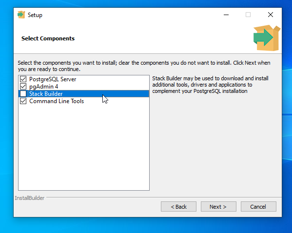
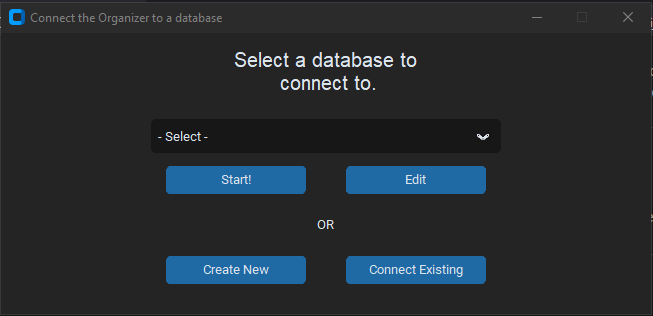
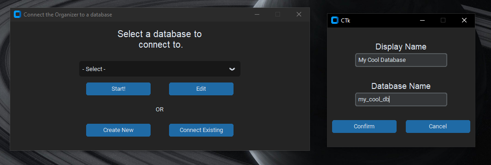
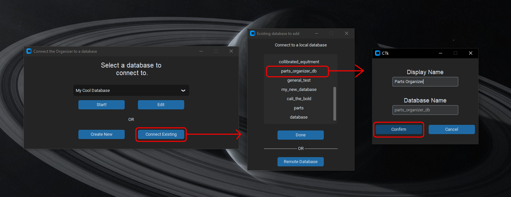
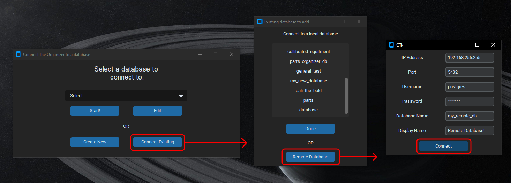

# Blur Part Organizer

This program is intended to help organize parts, calibrated equipment,
etc. by utilizing a PostgreSQL database. This program should be set up
on a dedicated kiosk machine near the parts intended to be organized.

If you're reading this in the program, to begin, select one of the sections on the left side of the window.

If you're reading this from GitHub, this README file is displayed on the program's home 
screen.

### Initial setup

1. first, download the latest version of the [Zebra ZSB Print Drivers](https://zsbportal.zebra.com/apps).

2. Go through the ZSB printer setup and make sure that the printer is working
   by printing a test label.

3. If you are going to be hosting a local database, download [PostgreSQL](https://www.enterprisedb.com/downloads/postgres-postgresql-downloads). 

4. Run the PostgreSQL setup, unchecking the box for Stack Builder

4. Continue through the installer accepting all defaults, entering `blur4321` when 
prompted for a password

5. In the Blur Organizer under the `Danger Zone` tab, select `Format Database` to
set up the database

## Database Selector

The first screen that will open when the program is run is the database selector screen.

### Creating a Local Database

Click on the `Create New` button. This will open a popup window where you will 
enter the reference name for your database and the name that PostgreSQL sees.

Once you have entered this and clicked `Confirm`, it will add the database to the dropdown menu.

### Connecting an Existing Local Database

If you've already created a database in PostgreSQL, but it isn't connected to the organizer, click on `Connect Existing`.

A list of every database in your local PostgreSQL will appear. Click on the one that you want to link.

You will then be prompted for a new display name for this database. Whatever you enter will be added to the dropdown menu.

### Connecting to a Remote Database

If you want synchronization of data across devices, for example having multiple kiosks set up linking to one database, click on `Connect Existing` and then `Remote Database`.

Enter the credentials of the database that you want to connect to. `Display Name` is simply the name that will be shown in the dropdown and is not something from the remote host.

When you've entered the connection credentials hit `Connect` and it will add the new database to the dropdown. Hit `Start!` to launch the organizer.

### Editing or Deleting a Database Link.

Note: from this menu you can only edit or delete the database link, NOT the actual
database. If you want to actually delete the database, you need to do that from
the `Danger Zone` tab in the program.

To edit the information of a database link or to delete a database, select it in the dropdown and hit `Edit`. This process is the same for both remote and local databases. 

From here you can either edit the database info and hit `Connect` or `Done`, or you can hit `Delete` to remove the link.